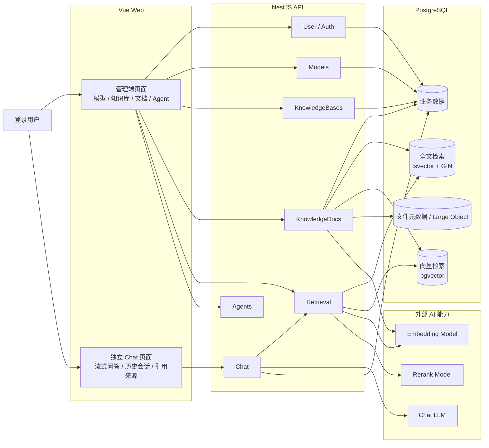

# Zeta

AI 知识库管理平台，围绕企业知识从生产、管理、检索到 Agent 消费的闭环构建。

当前主链路：

```text
模型配置 -> 知识库 -> 文档分段 -> 检索测试 -> 专家 Agent -> 流式问答与引用来源 -> 对话日志标注入库
```

Zeta 当前采用轻量 pnpm workspace Monorepo。前端是一个 Vue Web 应用，内部包含管理端页面和独立 Chat 页面；后端是 NestJS 模块化单体，统一负责数据库、检索、模型调用和业务流程。

## 技术栈


- 前端框架：Vue 3、Vite、TypeScript、Vue Router。
- 前端状态与请求：Pinia、pinia-plugin-persistedstate、axios、@microsoft/fetch-event-source。
- 前端 UI：shadcn-vue、Tailwind CSS、vue-sonner、lucide-vue-next、md-editor-v3、vue-draggable-plus。
- 后端框架：NestJS 11、TypeScript、JWT、bcrypt、全局拦截器和统一响应封装。
- 数据访问：Prisma 7、Prisma migration、Prisma seed、PostgreSQL 16。
- 检索能力：PostgreSQL 全文检索、pgvector 向量检索、可选文本 Rerank、Chunk Embedding、RAG 检索增强生成。
- AI 接入：阿里云百炼 `text-embedding-v4`、`qwen3-rerank`、视觉模型和 DeepSeek 对话模型，主要走 OpenAI-compatible 协议。
- 工程工具：pnpm workspace、ESLint、Oxlint、Prettier、Husky、lint-staged。
- 部署运行：Docker Compose、Nginx、生产多阶段 Dockerfile。

## 核心流程

### 系统架构



### Agent 问答流程

```mermaid
flowchart LR
    question[用户发送问题]
    session[创建或读取 ChatSession]
    agent[读取 Agent 配置和绑定知识库]
    embed[问题向量化]
    retrieve[召回相关 Chunk]
    prompt[组装 Prompt 和引用上下文]
    llm[调用 Chat LLM]
    stream[SSE 流式返回回答]
    persist[保存消息和引用]
    source[展示引用来源]

    question --> session --> agent --> embed --> retrieve --> prompt --> llm --> stream --> persist --> source

    style question fill:#e1f5fe
    style retrieve fill:#fff3e0
    style llm fill:#ede7f6
    style stream fill:#e8f5e9
    style source fill:#fce4ec
```



## 核心功能

- 登录与默认账号：首版只做登录，不做注册；默认账号由 Prisma seed 初始化。
- 模型管理：维护 Chat、Embedding、Reranker 和视觉模型配置。
- 知识库管理：创建知识库，绑定 Embedding 模型，可选绑定文本重排模型、图片理解模型和图片理解提示词。
- 文档列表：按知识库管理文档、来源、状态、字符数和分段数。
- 文档导入：上传 Markdown、TXT、HTML、PDF、DOCX、CSV、XLSX、XLS，解析为分段草稿，人工调整后确认入库。
- 图片理解：DOCX 内嵌图片和 PDF 页面图会保存为文件资产；知识库配置视觉模型后，会额外生成图片理解 Chunk，继续进入全文索引和向量检索。
- 分段管理：支持新增、编辑、删除、启停和拖拽重排分段。
- 索引与检索：为启用分段写入全文索引和向量 Embedding，支持全文 + 向量混合召回；知识库配置 Reranker 后，会调用文本重排模型精排候选分段。
- 知识热度：基于 Agent Chat 回答中的引用记录统计热门文档和热门分段。
- 专家 Agent：配置 Prompt、Chat 模型，并绑定一个或多个知识库。
- Chat 问答：独立聊天页面，支持 SSE 流式回答、历史会话和引用来源。
- 对话日志标注：管理端可把有价值的 AI 回答标注回知识库，形成 AI 提炼文档和分段。
- 删除策略：删除知识库、Agent、模型时清理内部数据或解除绑定关系，避免要求用户手动层层解绑。

## 推荐演示路径

1. 使用默认账号 `admin / 123456` 登录系统。
2. 在模型管理中确认已有 Chat 模型、启用的 Embedding 模型；如需演示精排和图片理解，再配置 `qwen3-rerank` 重排模型和一个视觉模型。
3. 创建一个知识库，例如“企业制度知识库”，在知识库设置中选择 Embedding 模型；如已配置重排或视觉模型，可同时选择重排模型、图片理解模型并调整提示词。
4. 进入知识库文档管理，上传 `docs/demo/it-account-onboarding.md`。
5. 在上传页查看 Markdown 解析出的分段草稿，编辑一个分段标题或内容后确认入库。
6. 继续上传 CSV、PDF 或 DOCX 样例，演示表格按行分段、PDF 结构化分段、DOCX 标题和图片资产保留。
7. 进入分段页，演示分段的新增、编辑、启停、排序和删除；如果知识库配置了视觉模型，可查看图片理解 Chunk。
8. 回到文档列表，打开检索测试，提问“VPN 权限多久生效？”并查看命中分段、来源、命中原因和分数；如果配置了重排模型，结果会显示“已重排”和重排分数。
9. 创建或选择一个绑定该知识库的专家 Agent，进入 Chat 页面提问“采购合同超过 100 万需要哪些审批？”。
10. 查看 AI 回答下方的引用来源，并打开引用详情确认回答可追溯到文档分段。
11. 回到 Agent 管理页，进入对话日志，将某条 AI 回答标注入库。
12. 回到知识库文档列表或分段页，确认出现“AI 提炼”来源的文档或新增分段。
13. 打开知识热度页面，确认 Agent Chat 的引用会计入热度统计；检索测试只用于调试，不计入热度。

## 演示材料

仓库内提供企业场景样例，可直接用于知识库上传测试：

| 文件                                                    | 场景                                                           | 推荐问题                            |
| ------------------------------------------------------- | -------------------------------------------------------------- | ----------------------------------- |
| `docs/demo/it-account-onboarding.md`                    | 入职账号、邮箱、飞书、VPN、MFA                                 | `VPN 权限多久生效？`                |
| `docs/demo/it-account-onboarding.pdf` / `.docx`         | 同一场景的 PDF / DOCX 版本，用于验证结构化解析和 Word 标题分段 | `MFA 没绑定会影响什么？`            |
| `docs/demo/procurement-contract-approval.md`            | 采购合同、审批材料、金额节点、风险条款                         | `采购合同超过 100 万需要哪些审批？` |
| `docs/demo/procurement-contract-approval.pdf` / `.docx` | 同一场景的 PDF / DOCX 版本，用于验证多格式导入                 | `采购合同需要准备哪些材料？`        |
| `docs/demo/security-incident-response.md`               | 钓鱼邮件、账号异常、数据泄露、安全事件上报                     | `发现钓鱼邮件应该多久内上报？`      |
| `docs/demo/security-incident-response.pdf` / `.docx`    | 同一场景的 PDF / DOCX 版本，用于验证结构化分段和引用追溯       | `账号异常登录应该怎么处理？`        |
| `docs/demo/expense-policy-table.csv`                    | 报销费用类型、限额、审批人、生效时间                           | `客户招待费用的单次限额是多少？`    |

这些样例用于演示文档上传、分段预览、检索测试、Agent 引用回答、知识热度和对话日志标注入库。CSV 样例可在上传页切换到“表格”模式后导入，系统会把第一行作为表头，并将后续每一行转换为一个可检索分段。PDF / DOCX 样例已经随仓库提供，`docs/demo/pdf-docx-import.md` 保留为自行生成更多测试文件的说明。

## 快速开始

### 1. 安装依赖

```bash
cd Zeta
pnpm install
```

### 2. 准备环境变量

```bash
cp .env.example .env
```

本地默认连接 Docker 中的 PostgreSQL：

```env
DATABASE_URL="postgresql://zeta@localhost:5432/zeta?schema=public"
```

如果需要使用默认阿里云百炼 Embedding 模型，把真实 key 写入本地 `.env`：

```env
DASHSCOPE_API_KEY="your-api-key"
```

不要把真实 API Key、数据库密码或生产密钥提交到仓库。

### 3. 启动本地 PostgreSQL

```bash
pnpm infra:up
```

本地基础设施使用 `pgvector/pgvector:0.8.2-pg16`，初始化时会启用 `vector` 扩展。

### 4. 初始化数据库

```bash
pnpm --filter @zeta/server exec prisma migrate dev
pnpm --filter @zeta/server exec prisma db seed
```

默认登录账号：

```text
用户名：admin
密码：123456
```

### 5. 启动前后端

```bash
pnpm all
```

默认启动：

- Web：Vite 开发服务地址以终端输出为准。
- API：NestJS 开发服务地址以终端输出为准。

## 常用命令

### 开发

```bash
pnpm web
pnpm server
pnpm all
```

### 质量检查

```bash
pnpm lint
pnpm type-check
pnpm --filter @zeta/web type-check
pnpm --filter @zeta/web build
pnpm --filter @zeta/server build
```

### 本地基础设施

```bash
pnpm infra:up
pnpm infra:ps
pnpm infra:logs
pnpm infra:down
```

### Prisma

```bash
pnpm --filter @zeta/server exec prisma migrate dev
pnpm --filter @zeta/server exec prisma migrate deploy
pnpm --filter @zeta/server exec prisma generate
pnpm --filter @zeta/server exec prisma db seed
```

### 生产 Docker

先准备生产环境变量：

```bash
cp .env.production.example .env.production
```

再按需执行：

```bash
pnpm docker:prod:build
pnpm docker:prod:migrate
pnpm docker:prod:seed
pnpm docker:prod:up
pnpm docker:prod:ps
```

也可以使用部署脚本：

```bash
bash scripts/deploy.sh
```

部署脚本会按顺序启动 PostgreSQL、构建镜像、执行 Prisma migration、执行 seed、启动 API 和 Web。

## 项目结构

```text
Zeta/
├── .husky/                          # Git hooks
├── docs/                            # 项目文档和实现方案
├── apps/
│   └── web/                         # Vue Web 应用
│       ├── src/
│       │   ├── apis/                # 前端 API 请求封装
│       │   ├── assets/              # 全局样式和静态资源
│       │   ├── components/          # 通用组件
│       │   ├── layout/              # 管理端 Layout
│       │   ├── router/              # Vue Router 模块路由
│       │   ├── stores/              # Pinia 状态
│       │   ├── utils/               # 前端工具函数
│       │   └── views/               # 页面
│       │       ├── Login/           # 登录页
│       │       ├── Models/          # 模型管理
│       │       ├── KnowledgeBases/  # 知识库列表
│       │       ├── KnowledgeDocuments/ # 文档列表
│       │       ├── DocumentUpload/  # 上传文档流程页
│       │       ├── Paragraph/       # 分段预览与编辑
│       │       ├── Agents/          # Agent 管理
│       │       ├── ChatLogs/        # Agent 对话日志与标注入库
│       │       └── Chat/            # 独立聊天页
│       ├── package.json
│       └── vite.config.ts
│
├── server/                          # NestJS 后端 API 服务
│   ├── prisma/                      # Prisma schema、migration、seed
│   ├── src/                         # 后端业务模块
│   │   ├── user/                    # 登录、刷新 token、当前用户
│   │   ├── auth/                    # 密码哈希、JWT 签发与校验
│   │   ├── models/                  # 模型配置
│   │   ├── knowledge-bases/         # 知识库管理
│   │   ├── knowledge-docs/          # 文档、分段、入库与检索测试
│   │   ├── agents/                  # Agent 配置与知识库绑定
│   │   └── chat/                    # 会话、消息、SSE 流式问答
│   │
│   └── libs/
│       └── shared/                  # 后端内部共享库
│           ├── auth/                # AuthGuard 等认证公共能力
│           ├── embedding/           # Embedding 调用封装
│           ├── file-storage/        # 文件元数据与 Large Object 存储
│           ├── generated/           # Prisma Client 生成代码
│           ├── interceptor/         # 全局拦截器
│           ├── parser/              # 文件解析器：Markdown、TXT、HTML、PDF、DOCX、表格
│           ├── prisma/              # Prisma Module / Service
│           ├── response/            # 统一响应封装
│           ├── retrieval/           # 混合检索服务
│           ├── rerank/              # 文本重排服务
│           └── text-splitter/       # 文本切分能力
│
├── packages/
│   └── common/                      # 前后端共享 API 契约类型
│       ├── agents/
│       ├── chat/
│       ├── knowledge-docs/
│       └── user/
│
├── docker-infra/                    # 本地基础设施配置
├── docker/                          # 生产 nginx 配置
├── docker-compose.infra.yml         # 本地 PostgreSQL 基础设施
├── docker-compose.prod.yml          # 生产部署编排
├── Dockerfile                       # 生产镜像构建
├── package.json                     # 根脚本
├── pnpm-lock.yaml
└── pnpm-workspace.yaml
```

## 架构说明

Zeta 不拆微服务，也不拆多个前端应用。当前选择是：

1. **轻量 Monorepo**
   - 使用 pnpm workspace 管理 `apps/web`、`server` 和 `packages/common`。
   - 不引入额外任务编排工具，降低个人开发和部署复杂度。

2. **一个 Vue Web 应用**
   - 管理端页面负责模型、知识库、文档、分段和 Agent 配置。
   - Chat 页面脱离后台 Layout，作为独立知识消费入口。

3. **NestJS 模块化单体**
   - 后端按业务模块拆分，但部署上仍是一个 API 服务。
   - 前端只访问 NestJS API，不直接访问 PostgreSQL、Prisma、模型供应商密钥或文件存储。

4. **PostgreSQL 作为核心存储**
   - 业务数据、文档元数据、分段、聊天记录和引用关系都落在 PostgreSQL。
   - 全文检索使用 PostgreSQL `tsvector` / GIN。
   - 语义检索使用 pgvector。
   - 文本重排使用 OpenAI-compatible `/reranks`，当前推荐阿里云百炼 `qwen3-rerank`。
   - 文件原文首版按 PostgreSQL Large Object 方案设计。

5. **RAG 问答链路**
   - 用户提问后，后端在 Agent 绑定知识库内召回 Chunk。
   - 如果知识库配置了重排模型，后端会先召回更多候选，再按 Rerank 分数筛选最终 TopK。
   - 后端组装 Prompt 并调用 Chat 模型。
   - 回答通过 SSE 流式返回。
   - 回答结束后保存 ChatMessage 和 ChatCitation，引用可回溯到 Document 和 Chunk。

## 环境变量

本地开发环境变量位于仓库根目录 `.env`，可以从 `.env.example` 复制。

| 变量                        | 说明                                        |
| --------------------------- | ------------------------------------------- |
| `DATABASE_URL`              | PostgreSQL 连接串                           |
| `AUTH_TOKEN_SECRET`         | JWT 签名密钥                                |
| `ACCESS_TOKEN_TTL_SECONDS`  | Access Token 有效期                         |
| `REFRESH_TOKEN_TTL_SECONDS` | Refresh Token 有效期                        |
| `SEED_ADMIN_USERNAME`       | seed 默认管理员用户名                       |
| `SEED_ADMIN_PASSWORD`       | seed 默认管理员密码                         |
| `SEED_ADMIN_DISPLAY_NAME`   | seed 默认管理员展示名                       |
| `DASHSCOPE_API_KEY`         | 阿里云百炼 API Key，用于默认 Embedding 模型 |
| `POSTGRES_DB`               | 本地 PostgreSQL 数据库名                    |
| `POSTGRES_USER`             | 本地 PostgreSQL 用户名                      |
| `POSTGRES_PORT`             | 本地 PostgreSQL 宿主机端口                  |

生产部署环境变量位于 `.env.production`，可以从 `.env.production.example` 复制。生产环境必须设置数据库密码和高强度 `AUTH_TOKEN_SECRET`。

## 部署说明

### 本地基础设施

本地基础设施只包含 PostgreSQL：

```bash
pnpm infra:up
```

当前本地 PostgreSQL 使用 `trust` 认证，方便开发，不适合直接用于生产。

### 生产部署

生产编排使用：

- `Dockerfile`
- `docker-compose.prod.yml`
- `.env.production`
- `docker/nginx.conf`

Web 容器使用 Nginx 托管前端静态产物，并把 `/api/` 反向代理到 API 服务。

推荐流程：

```bash
cp .env.production.example .env.production
bash scripts/deploy.sh
```

## 后续计划

- 多模态深化：当前已支持图片资产保留，并可通过视觉模型生成文本型图片理解 Chunk；后续候选是独立图片上传、OCR 专用服务和真正的图文向量检索。
- 检索准确率深化：当前已支持混合召回后的文本 Rerank；后续继续优化中文全文检索、重排参数解释和不同知识库场景下的命中稳定性。
- 复杂知识关系：后续评估跨文档引用、流程型知识、表格关系和知识版本变化的表达方式。
- UI 收口：继续参考 MaxKB 优化知识库 Workspace、文档管理、上传流程、分段页和 Agent 日志页面。
- 演示材料：根据后续答辩要求补充稳定的知识库样例、Agent 样例和演示脚本。

当前不引入 Playwright 等端到端自动化测试框架。交付前先按“推荐演示路径”进行人工验收；等功能稳定后，再考虑用 Playwright 自动化登录、上传、检索、聊天和引用回归。

暂不扩展 ZIP 批量导入、音频、视频、多租户、复杂权限和通用工具编排，优先把知识生产、检索解释和 Agent 消费这条主链路做扎实。
