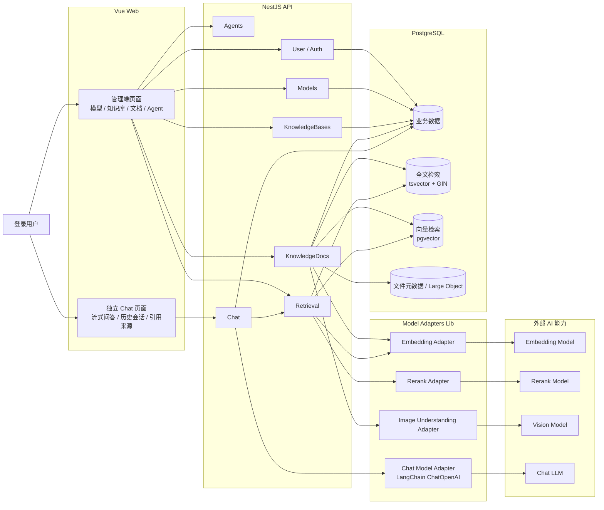

# 系统架构

Zeta 当前采用轻量 pnpm workspace Monorepo。前端是一个 Vue Web 应用，内部包含管理端页面和独立 Chat 页面；后端是 NestJS 模块化单体，统一负责数据库、检索、模型调用和业务流程。

## 模块关系

## Agent 问答流程

```mermaid
flowchart LR
    question[用户发送问题]
    session[创建或读取 ChatSession]
    agent[读取 Agent 配置和绑定知识库]
    embed[问题向量化]
    retrieve[召回相关 Chunk]
    prompt[组装 Prompt 和引用上下文]
    adapter[Chat Model Adapter<br/>LangChain]
    llm[调用 Chat LLM]
    stream[SSE 流式返回回答]
    persist[保存消息和引用]
    source[展示引用来源]

    question --> session --> agent --> embed --> retrieve --> prompt --> adapter --> llm --> stream --> persist --> source
```

## 架构取舍

- 不拆微服务：当前后端是 NestJS 模块化单体，便于本地开发、演示和部署。
- 不拆多个前端应用：管理端和 Chat 页面都在同一个 Vue 应用中，通过路由和 Layout 区分。
- 模型调用放在后端：前端不接触模型供应商密钥。
- RAG 可追溯：回答引用保存为结构化 Citation，可回溯到 Document 和 Chunk。
- Chat 生成层使用 LangChain.js：只把标准对话模型调用交给 LangChain，Embedding、Rerank、图片理解仍由 Zeta 的 model-adapters 管理。
