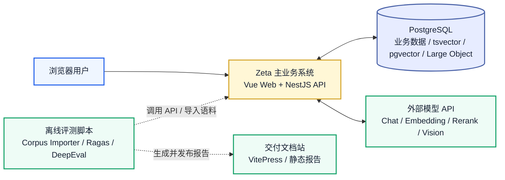
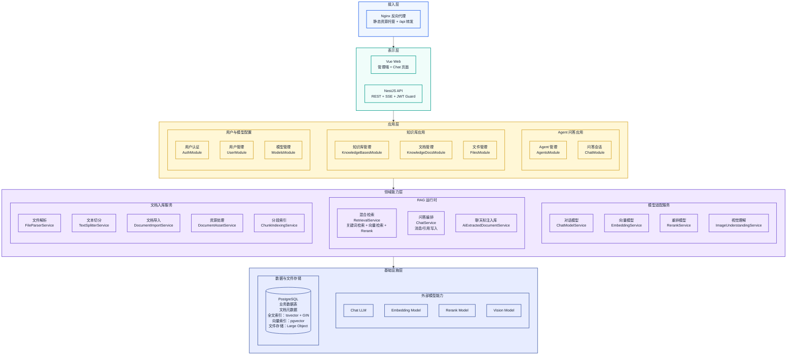
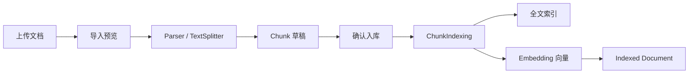
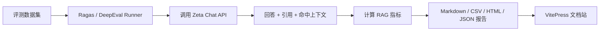

# 系统架构

Zeta 当前采用轻量 pnpm workspace Monorepo。前端是一个 Vue Web 应用，内部包含管理端页面和独立 Chat 页面；后端是 NestJS 模块化单体，统一负责数据库、检索、模型调用和业务流程。

本页参考 C4 架构图的渐进表达方式：先用系统上下文图说明边界，再用分层架构图说明内部职责，最后用流程图说明关键动态链路。

## 系统上下文图

这张图只表达 Zeta 和外部世界的边界关系，不展开内部模块细节。

## 分层架构图

这张图表达主业务系统内部的分层职责。箭头只表示上层依赖下层，不表示所有 service 调用。

其中 `RetrievalService` 会合并关键词召回和向量召回；知识库配置 Reranker 后，再对候选分段进行精排。
`ChatModelService` 当前基于 LangChain.js `ChatOpenAI` 接入 OpenAI-compatible 对话模型。
应用层节点采用“功能名 + NestJS Module”，领域层节点采用“能力名 + Service”，方便中文汇报时先读职责，再对应到代码实现。
接入层只表达生产部署中的 Nginx 反向代理；表示层承接 Vue Web 页面和 NestJS 暴露的 REST/SSE API。
`AiExtractedDocumentService` 当前服务于聊天日志的改进标注入库：把人工确认的回答片段写成知识库分段并完成索引，不表示自动 AI 提炼流程已经落地。
`ParserModule` 是 NestJS 依赖注入模块，负责注册 `FileParserService`、各格式 Parser 和 `TextSplitterService`，因此没有作为运行时服务节点单独放进图里。
`Citation` 和 `ChatMessage` 是对话引用与消息记录，不是独立 Service；它们由 `ChatService` 写入 PostgreSQL，在流程图中用“保存消息和引用”表达。

## Agent 问答流程

```mermaid
flowchart LR
    question[用户发送问题]
    session[创建或读取 ChatSession]
    agent[读取 Agent 配置和绑定知识库]
    embed[问题向量化]
    retrieve[召回相关 Chunk]
    prompt[组装 Prompt 和引用上下文]
    adapter[对话模型适配器<br/>LangChain]
    llm[调用 Chat LLM]
    stream[SSE 流式返回回答]
    persist[保存消息和引用]
    source[展示引用来源]

    question --> session --> agent --> embed --> retrieve --> prompt --> adapter --> llm --> stream --> persist --> source
```

## 文档入库流程

## 离线评测流程

## 架构取舍

- 不拆微服务：当前后端是 NestJS 模块化单体，便于本地开发、演示和部署。
- 不拆多个前端应用：管理端和 Chat 页面都在同一个 Vue 应用中，通过路由和 Layout 区分。
- 模型调用放在后端：前端不接触模型供应商密钥。
- RAG 可追溯：回答引用保存为结构化 Citation，可回溯到 Document 和 Chunk。
- Chat 生成层使用 LangChain.js：只把标准对话模型调用交给 LangChain，Embedding、Rerank、图片理解仍由 Zeta 的 model-adapters 管理。
