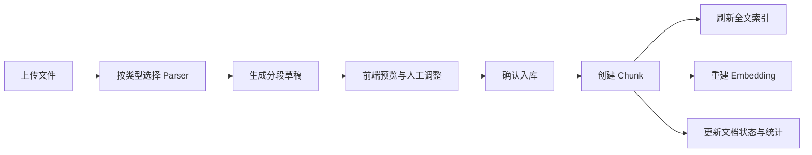
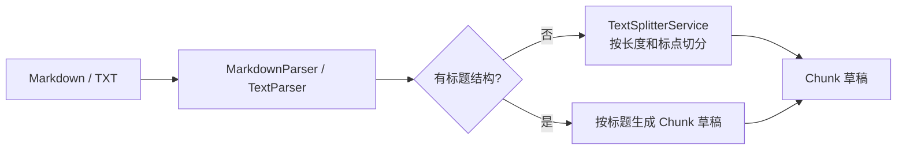
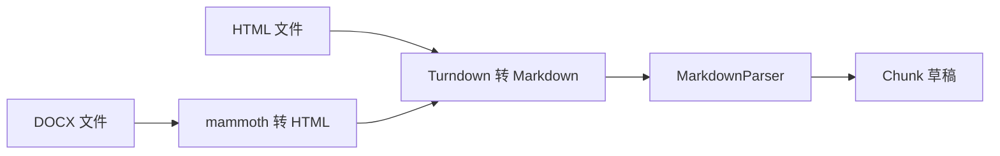
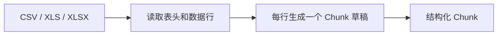
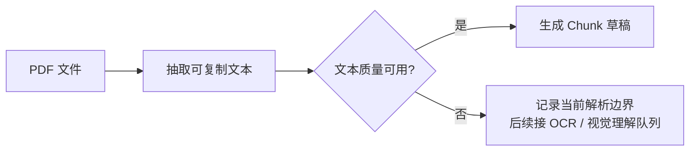

# 文件解析链路

多格式导入的目标不是把所有文件粗暴转成纯文本，而是按文件类型尽量保留标题、表格、图片引用等结构信息，再进入统一的 Chunk、全文索引和 Embedding 流程。

## 总体流程

## 处理方式

| 格式           | 处理方式                                          | 当前取舍                                                     |
| -------------- | ------------------------------------------------- | ------------------------------------------------------------ |
| Markdown / TXT | Markdown 按标题结构分段，TXT 按长度和标点兜底切分 | 简单稳定，适合普通文档和手写知识                             |
| HTML / DOCX    | 先转成 Markdown，再复用 Markdown 分段能力         | 复用一套分段逻辑，尽量保留标题、列表、表格和图片引用         |
| CSV / Excel    | 第一行作为表头，后续每行一个 Chunk                | 适合审批矩阵、FAQ 表、权限清单等业务表格                     |
| PDF            | 文本 PDF 使用 `pdfjs-dist` 抽取文本并推断结构     | 当前先支持文本 PDF，复杂 PDF 后续通过 OCR 或视觉理解队列增强 |

## Markdown / TXT

Markdown 优先保留标题层级；TXT 没有结构信息，所以用长度和标点做兜底切分。

## HTML / DOCX

HTML 和 DOCX 都先进入 Markdown 链路，避免分别维护两套分段规则。DOCX 图片会作为资产保存，Markdown 中保留图片引用。

## CSV / Excel

表格文件更适合按行入库。每个 Chunk 会带上表头语义，方便检索“限额、审批人、生效时间”这类业务问题。

## PDF

PDF 是当前边界最明显的格式。文本 PDF 可以先抽取内容并尽量恢复结构；扫描件、复杂合同、公文和字体映射异常的 PDF 仍可能出现文字顺序错乱、字符异常或标题还原不稳定。

当前策略是先保证文本 PDF 的主链路稳定，后续再评估 OCR fallback 或独立文档解析服务。
