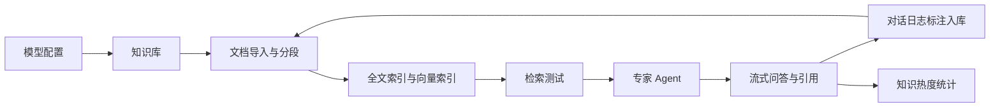

## 主链路

Zeta 当前不是一个通用工作流平台，而是优先把“企业知识进入系统、被检索、被 Agent 消费、再被沉淀回知识库”这条路径做完整。

## 系统架构快照

这张图按接入层、表示层、应用层、领域层和基础设施层整理当前系统边界。详细模块职责和关键链路见 [系统架构](/architecture)。

## 评测报告

当前文档站已发布离线 RAG 评测结果，包含 Ragas 指标和 DeepEval 本地 Markdown 报告。

- [最新 Ragas 报告](/eval-reports/latest)：展示当前基准数据集的召回、相关性、忠实度和诊断结果。
- [评测报告](/eval-reports/)：汇总最新 Ragas / DeepEval 指标，并保留历史报告、CSV 明细和 DeepEval JSON 原始数据。
- [RAG 评测说明](/rag-evaluation)：说明评测脚本、数据集、指标和报告发布方式。

## 交付入口

- [Demo 演示](/demo)：适合汇报时按步骤演示。
- [系统架构](/architecture)：说明前端、后端、模型适配、数据库和检索边界。
- [文件解析链路](/file-parsing)：说明多格式文档如何进入统一 Chunk 流程。
- [RAG 评测报告](/rag-evaluation)：说明离线 Ragas 评测、报告产物和当前边界。
