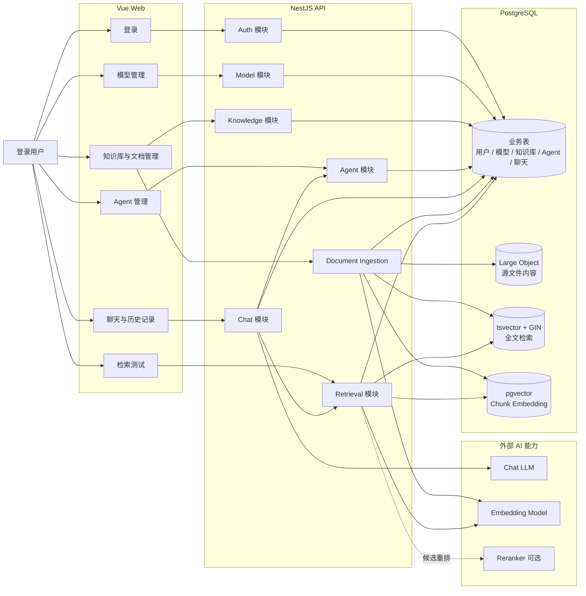
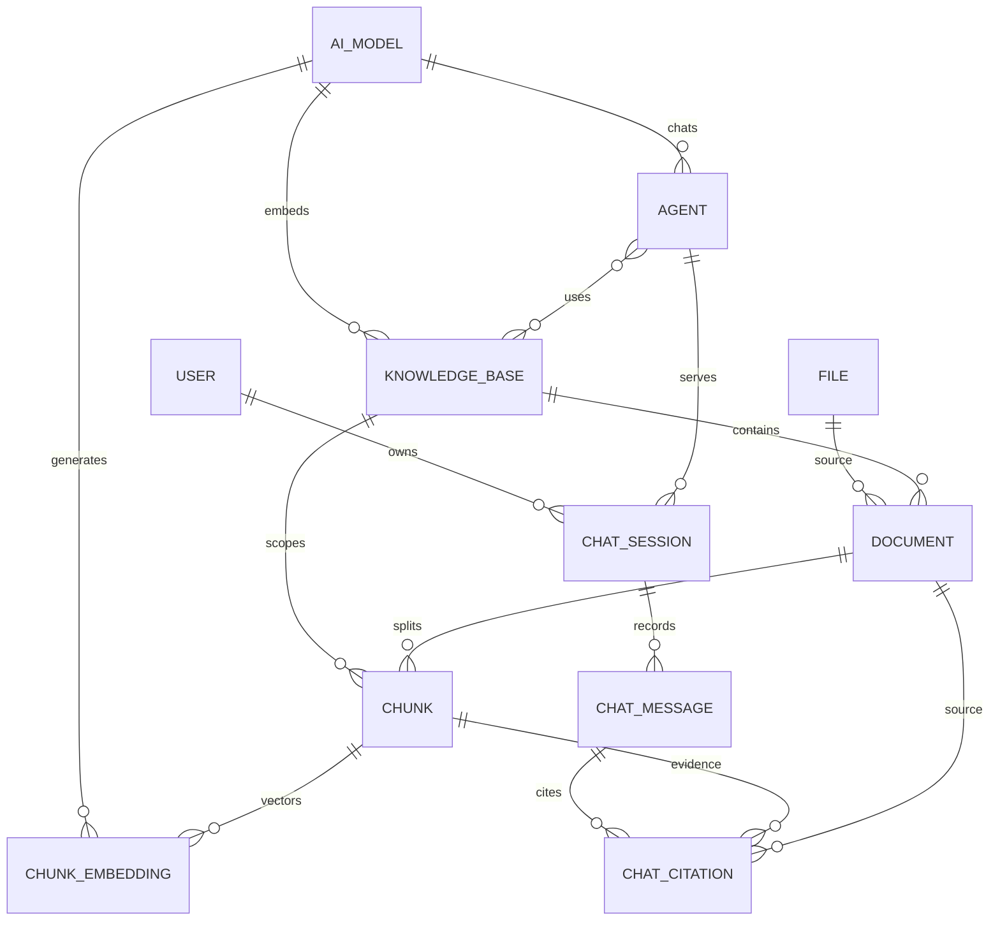
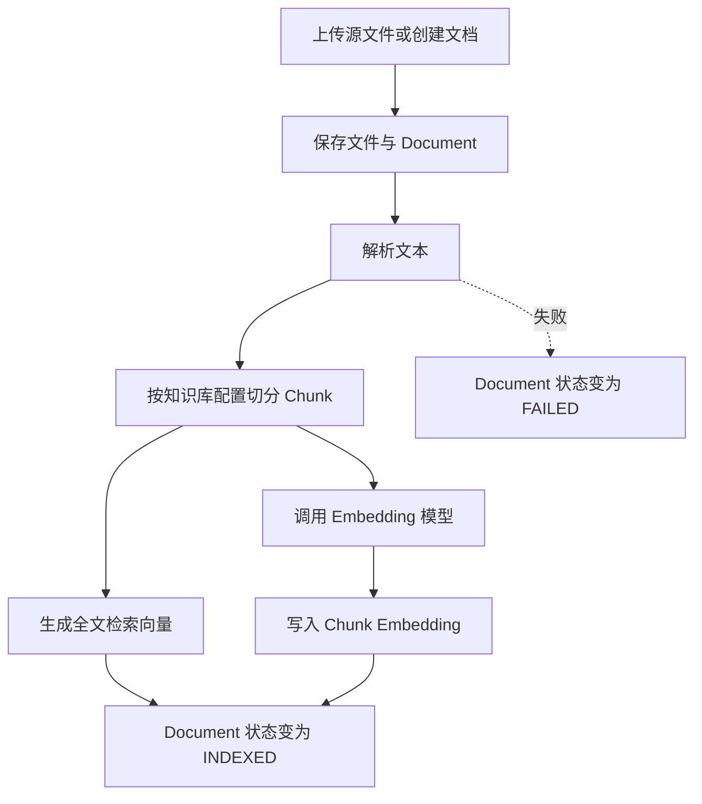
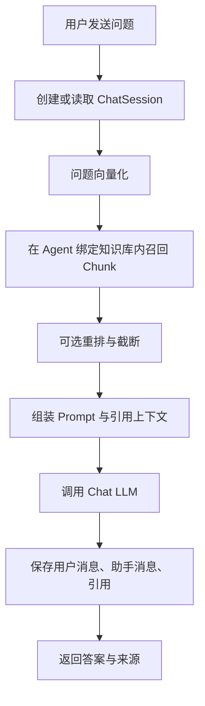

# Zeta MVP 实现方案

## 1. 目标

Zeta 首版实现一个可演示的 AI 知识库管理闭环：

1. 用户登录后进入管理端和聊天端。
2. 配置对话模型、Embedding 模型，Reranker 作为可选模型类型保留。
3. 创建知识库并导入知识文档。
4. 将文档解析为可检索的 Chunk，建立全文检索和向量检索数据。
5. 创建专家 Agent，绑定模型与知识库。
6. 用户与 Agent 对话，系统保存聊天记录并返回知识引用。

首版重点是让“知识生产 -> 知识检索 -> Agent 消费”跑通，而不是先做完整企业权限和复杂工作流。

## 2. MVP 范围

### 包含

- 登录，不开放注册。
- 模型管理：LLM、Embedding、Reranker 配置。
- 知识库管理：知识库、文档、状态、分段配置。
- 文档入库：源文件保存、文本解析、Chunk 切分、索引写入。
- 检索测试：按知识库检索命中 Chunk。
- Agent 管理：绑定对话模型和一个或多个知识库。
- 对话问答：检索增强回答、引用来源、聊天记录保存。

### 暂不包含

- 工具页、统计页、工作流编排。
- 注册、复杂角色权限、工作区、多租户。
- 标签体系和多级目录。
- 自动提炼知识闭环。
- 多模态专用解析链路。
- 独立对象存储服务。首版源文件随 PostgreSQL 管理。

## 3. 系统架构

## 4. 核心数据关系

当前数据设计的主线是：

- `KnowledgeBase` 是首版一级分类和检索范围。
- `Document` 是管理层知识条目。
- `Chunk` 是检索与引用的最小单位。
- `ChunkEmbedding` 保存 pgvector 向量。
- `ChatSession` 归属登录用户，并保留回答所用 Agent。

## 5. 两条主流程

### 文档入库流程

首版实现时优先支持一种稳定文档格式，把入库状态跑通，再扩展解析器类型。

### Agent 问答流程

## 6. 后端模块建议

| 模块 | MVP 职责 |
| --- | --- |
| `auth` | 登录、token 校验、当前用户识别 |
| `model` | 模型配置 CRUD，区分 Chat、Embedding、Reranker |
| `knowledge` | 知识库和文档管理入口 |
| `file` | PostgreSQL Large Object 文件写入、读取、清理 |
| `ingestion` | 文档解析、切分、全文索引、向量化状态推进 |
| `retrieval` | 问题向量化、知识库过滤、全文/向量召回、候选组织 |
| `agent` | Agent 配置和知识库绑定 |
| `chat` | 会话、消息、引用、RAG 问答编排 |

模块可以先按 NestJS 业务模块落在后端，不需要首版就拆成复杂微服务。

## 7. 前端页面建议

| 页面 | MVP 内容 |
| --- | --- |
| 登录页 | 用户名、密码、登录态进入系统 |
| 模型管理 | 模型列表、添加模型、启停状态 |
| 知识库列表 | 创建知识库、查看状态、进入详情 |
| 知识库详情 | 文档列表、上传文档、入库状态、检索测试 |
| Agent 列表与配置 | Agent 基础信息、模型选择、知识库绑定、系统提示词 |
| 聊天页 | Agent 对话、引用展示、历史会话列表 |

## 8. 实施顺序

1. 打通基础设施：PostgreSQL、Prisma、全局响应、鉴权基础。
2. 完成模型管理，先确保 Chat 和 Embedding 配置可被后续模块引用。
3. 完成知识库、文件和文档管理。
4. 打通文档解析、Chunk 切分、全文索引和向量写入。
5. 完成检索测试，先验证召回质量和引用来源。
6. 完成 Agent 配置与知识库绑定。
7. 完成聊天问答、会话历史和引用落库。
8. 收口 Demo 体验：失败状态、空状态、加载态、演示数据。

## 9. MVP 验收标准

- 能登录进入系统。
- 能配置至少一个 Chat 模型和一个 Embedding 模型。
- 能创建知识库并导入文档。
- 文档能形成 Chunk 和检索数据，失败时有状态可见。
- 能在知识库内检索到命中片段。
- 能创建 Agent 并绑定知识库。
- Agent 能基于命中知识回答，并返回引用来源。
- 用户能查看自己的历史会话。
