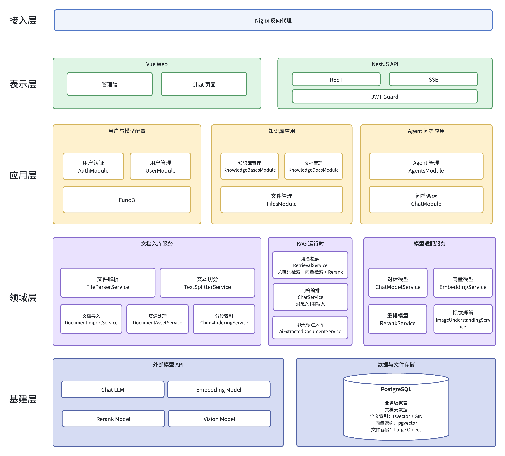
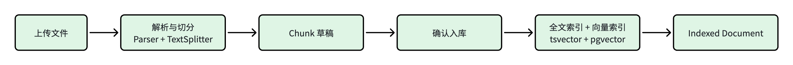
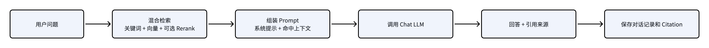
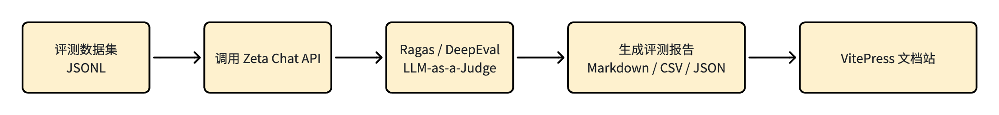

# Zeta 项目交付报告

> 面向导师查看的项目说明材料。本文整理项目入口、基本架构、核心流程、Demo 路径、离线评测结果和当前边界。

## 1. 项目入口

| 类型              | 地址 / 说明                                                   |
| ----------------- | ------------------------------------------------------------- |
| 代码仓库          | <https://github.com/UserKei/Zeta>                             |
| 线上文档站        | <https://userkei.github.io/Zeta/>                             |
| 文档站 Demo 页    | <https://userkei.github.io/Zeta/demo>                         |
| 文档站系统架构页  | <https://userkei.github.io/Zeta/architecture>                 |
| 文档站文件解析页  | <https://userkei.github.io/Zeta/file-parsing>                 |
| RAG 评测页        | <https://userkei.github.io/Zeta/rag-evaluation>               |
| Ragas 最新报告    | <https://userkei.github.io/Zeta/eval-reports/ragas/latest>    |
| DeepEval 最新报告 | <https://userkei.github.io/Zeta/eval-reports/deepeval/latest> |

业务系统 Demo 当前以本地启动为主，文档站用于线上交付说明、架构图、演示路径和离线评测报告展示。默认本地演示账号为：

```text
用户名：admin
密码：123456
```

## 2. 项目概述

Zeta 是一个 AI 知识库管理平台，首版围绕企业知识从生产、管理、检索到 Agent 消费的闭环构建。当前主链路为：

```text
模型配置 -> 知识库 -> 文档分段 -> 检索测试 -> 专家 Agent -> 流式问答与引用来源 -> 对话日志标注入库
```

项目重点不是只做一个聊天页面，而是把知识入库、结构化分段、全文/向量检索、RAG 问答、引用追溯和回答反哺串成一条可演示链路。

## 3. 基本架构

Zeta 采用轻量 pnpm workspace Monorepo：

- 前端：Vue 3 + Vite + TypeScript，包含管理端页面和独立 Chat 页面。
- 后端：NestJS 模块化单体，统一承接 API、数据库、文件处理、检索和模型调用。
- 数据层：PostgreSQL，使用 `tsvector + GIN` 做全文检索，使用 `pgvector` 做向量检索，文件资产可落在 PostgreSQL Large Object。
- 模型层：后端 `model-adapters` 统一适配 Chat、Embedding、Rerank 和视觉理解模型；Chat 生成层使用 LangChain.js `ChatOpenAI` 适配 OpenAI-compatible 接口。
- 交付与评测：VitePress 文档站展示说明和评测报告；Ragas / DeepEval 作为离线评测链路，不进入生产问答请求链路。



## 4. 核心流程

### 4.1 文档入库流程

文档上传后，后端按文件类型选择 Parser，先生成分段草稿供前端预览和人工调整；确认入库后再创建 Chunk、刷新全文索引、重建 Embedding，并更新文档状态。



### 4.2 Agent 问答流程

用户提问后，系统读取 Agent 配置和绑定知识库，执行混合检索与可选 Rerank，组装 Prompt 后调用 Chat 模型。回答通过 SSE 流式返回，并保存消息和 Citation，保证后续能追溯到具体 Document 和 Chunk。



### 4.3 离线评测流程

离线评测脚本读取 JSONL 数据集，调用已经启动的 Zeta Chat API，收集 Agent 回答、检索上下文和引用信息，再交给 Ragas / DeepEval 打分，并把报告发布到文档站。



## 5. 文件解析能力

多格式导入的目标不是把所有文件粗暴转成纯文本，而是尽量保留标题、表格、图片引用等结构信息，再进入统一的 Chunk、全文索引和 Embedding 流程。

| 格式           | 当前处理方式                                      | 说明                                                             |
| -------------- | ------------------------------------------------- | ---------------------------------------------------------------- |
| Markdown / TXT | Markdown 按标题结构分段，TXT 按长度和标点兜底切分 | 适合普通制度文档、FAQ 和手写知识                                 |
| HTML / DOCX    | 先转 Markdown，再复用 Markdown 分段能力           | 复用同一套分段逻辑，保留标题、列表、表格和图片引用               |
| CSV / Excel    | 第一行作为表头，后续每行一个 Chunk                | 适合审批矩阵、权限清单、报销限额等业务表格                       |
| PDF            | 文本 PDF 使用 `pdfjs-dist` 抽取文本并推断结构     | 当前优先支持文本 PDF；扫描件和复杂 PDF 后续接 OCR / 视觉理解增强 |

更详细的各格式流程图见线上文档站：<https://userkei.github.io/Zeta/file-parsing>

## 6. Demo 演示路径

推荐现场演示路径：

1. 使用默认账号登录系统。
2. 在模型管理中确认 Chat 模型、Embedding 模型已启用。
3. 创建知识库并绑定 Embedding 模型；如需演示精排，可继续绑定 Rerank 模型。
4. 上传 Markdown、CSV、DOCX 或 PDF 样例文档。
5. 在上传预览页检查分段草稿，必要时编辑标题、内容和启停状态。
6. 确认入库后进入分段页，查看 Chunk、图片引用和图片理解 Chunk。
7. 使用检索测试查看命中分段、来源文档和分数。
8. 创建专家 Agent，绑定 Chat 模型和知识库。
9. 进入 Chat 页面提问，查看 SSE 流式回答和引用来源。
10. 回到对话日志，将有价值的 AI 回答标注入库。
11. 查看知识热度页，确认回答引用会计入热门文档和热门分段统计。

仓库内置演示材料位于 `docs/demo/`，包含入职账号、采购合同、安全事件、报销表格和带图 Word 材料。线上 Demo 说明页：<https://userkei.github.io/Zeta/demo>

## 7. RAG 评测结果

当前离线评测使用 GitLab Handbook 样例集，共 30 条问答用例。Ragas 与 DeepEval 都通过 HTTP 调用 Zeta Chat API，而不是绕过业务链路直接 mock 模型结果。

| 工具     | 用例结果 | answer_relevancy | context_precision | context_recall | faithfulness |
| -------- | -------: | ---------------: | ----------------: | -------------: | -----------: |
| Ragas    |    30/30 |           0.9178 |            0.7311 |         0.8667 |       0.9274 |
| DeepEval |    21/30 |           0.8441 |            0.7678 |         0.9000 |       0.9381 |

评测重点：

- `answer_relevancy`：回答是否切中用户问题。
- `context_precision`：检索上下文中有多少内容真正有用。
- `context_recall`：是否召回了参考答案需要的关键信息。
- `faithfulness`：回答是否忠实于检索上下文，避免无依据生成。

报告入口：

- RAG 评测概览：<https://userkei.github.io/Zeta/rag-evaluation>
- Ragas 最新报告：<https://userkei.github.io/Zeta/eval-reports/ragas/latest>
- DeepEval 最新报告：<https://userkei.github.io/Zeta/eval-reports/deepeval/latest>

## 8. 当前边界与后续方向

- PDF：当前主链路优先支持文本 PDF；扫描件、复杂合同、公文和字体映射异常 PDF 仍可能出现抽取质量问题，后续考虑 OCR 或视觉理解队列增强。
- 多模态：当前多模态以“图片理解文本 Chunk”方式进入检索链路，还不是完整图文向量检索。
- 评测：当前是离线评测，不做线上实时质量监控；后续可以把评测报告持续发布到文档站或接入更完整的评测看板。
- 架构：后端暂不拆微服务，保持 NestJS 模块化单体，优先保证主链路清晰和演示稳定。

## 9. 导师查看建议

建议先查看线上文档站首页，再按下面顺序浏览：

1. 项目介绍：<https://userkei.github.io/Zeta/>
2. Demo 演示：<https://userkei.github.io/Zeta/demo>
3. 系统架构：<https://userkei.github.io/Zeta/architecture>
4. 文件解析链路：<https://userkei.github.io/Zeta/file-parsing>
5. RAG 评测：<https://userkei.github.io/Zeta/rag-evaluation>

如果需要看源码实现，可结合代码仓库中的 `apps/web/`、`server/`、`server/libs/model-adapters/`、`evals/` 和 `apps/docs-site/` 目录查看。
